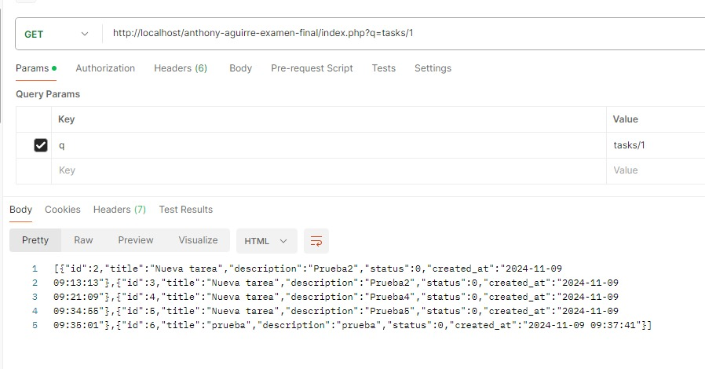
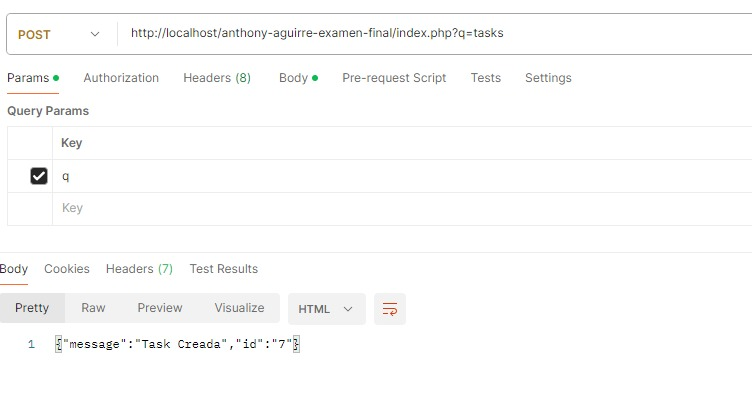
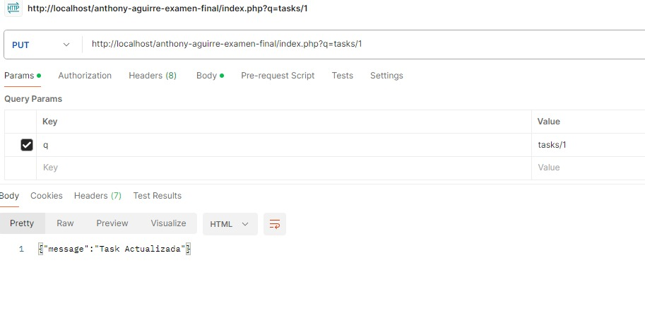
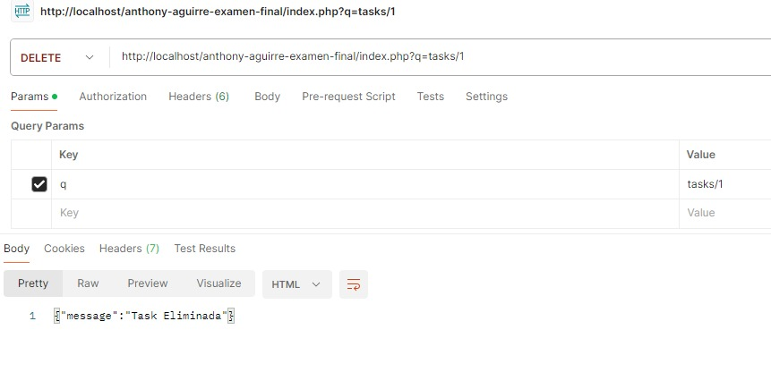
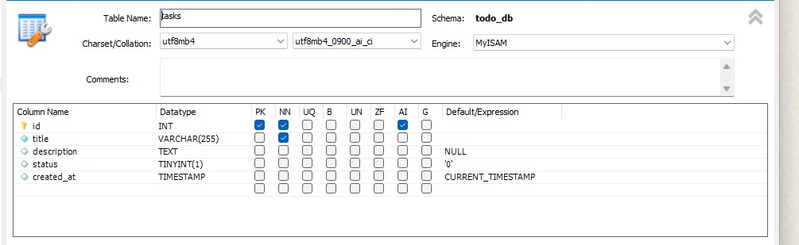
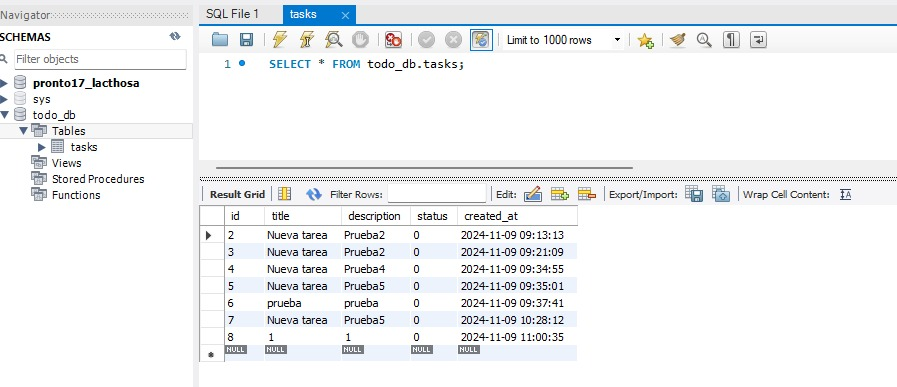

# anthony aguirre examen final
EXAMEN FINAL CURSO

ANTHONY STEVEN AGUIRRE CAMPOS

API REST

BASES DE DATOS Y PROGRAMACION WEB

Metodos API REST

GET
http://localhost/anthony-aguirre-examen-final/index.php?q=tasks/1

POST
http://localhost/anthony-aguirre-examen-final/index.php?q=tasks

PUT
http://localhost/anthony-aguirre-examen-final/index.php?q=tasks/1

DELETE
http://localhost/anthony-aguirre-examen-final/index.php?q=tasks/1

BASES DE DATOS
Revision de datos plasmados

Configuracion de la base de datos

